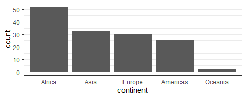
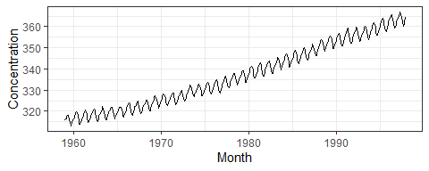
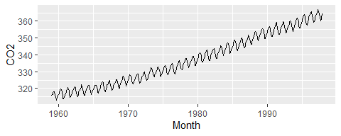
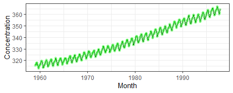
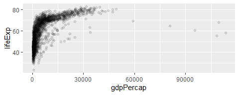
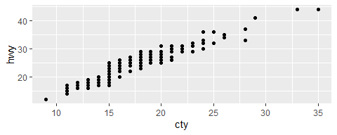
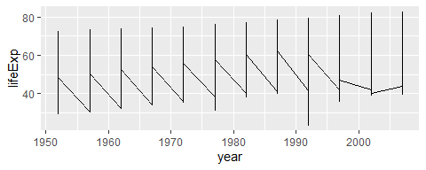
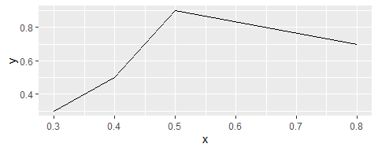
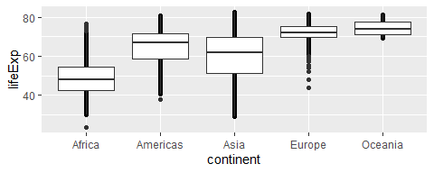
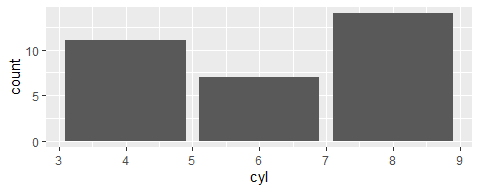

## Preliminary

Begin by loading the required packages. If you don't have these installed (or don't know whether you have them installed), you can install them by executing the following code in your console:

```
install.packages("tidyverse")
install.packages("scales")
install.packages("tsibble")
```

Now run this code chunk to load the packages:


```r
suppressPackageStartupMessages(library(tidyverse))
suppressPackageStartupMessages(library(gapminder))
suppressPackageStartupMessages(library(scales))
suppressPackageStartupMessages(library(tsibble))
knitr::opts_chunk$set(fig.align = "center")
```

<!---The following chunk allows errors when knitting--->


## Exercise 1: Bar Chart Grammar (Together)

Consider the following plot. Don't concern yourself with the code at this point.


```r
gapminder %>% 
  filter(year == 2007) %>% 
  mutate(continent = fct_infreq(continent)) %>% 
  ggplot(aes(continent)) +
  geom_bar() +
  theme_bw()
```



Fill in the seven grammar components for this plot.

| Grammar Component     | Specification |
|-----------------------|---------------|
| __data__              | `gapminder` |
| __aesthetic mapping__ | x: continent, y: count |
| __geometric object__  | bar |
| scale                 | linear |
| statistical transform | count |
| coordinate system     | rectangular |
| facetting             | no |

## Exercise 2: `ggplot2` Syntax (Your Turn)

The following is a tsibble (a special type of tibble containing time series data, which we'll see more of later), stored in the variable `mauna`, of CO$_2$ concentrations collected monthly at the Mauna Loa station.

Execute this code to store the data in `mauna`:


```r
(mauna <- tsibble::as_tsibble(co2) %>% 
   rename(month = index, conc = value))
```

<div data-pagedtable="false">
  <script data-pagedtable-source type="application/json">
{"columns":[{"label":["month"],"name":[1],"type":["S3: yearmonth"],"align":["right"]},{"label":["conc"],"name":[2],"type":["dbl"],"align":["right"]}],"data":[{"1":"1959 Jan","2":"315.42"},{"1":"1959 Feb","2":"316.31"},{"1":"1959 Mar","2":"316.50"},{"1":"1959 Apr","2":"317.56"},{"1":"1959 May","2":"318.13"},{"1":"1959 Jun","2":"318.00"},{"1":"1959 Jul","2":"316.39"},{"1":"1959 Aug","2":"314.65"},{"1":"1959 Sep","2":"313.68"},{"1":"1959 Oct","2":"313.18"},{"1":"1959 Nov","2":"314.66"},{"1":"1959 Dec","2":"315.43"},{"1":"1960 Jan","2":"316.27"},{"1":"1960 Feb","2":"316.81"},{"1":"1960 Mar","2":"317.42"},{"1":"1960 Apr","2":"318.87"},{"1":"1960 May","2":"319.87"},{"1":"1960 Jun","2":"319.43"},{"1":"1960 Jul","2":"318.01"},{"1":"1960 Aug","2":"315.74"},{"1":"1960 Sep","2":"314.00"},{"1":"1960 Oct","2":"313.68"},{"1":"1960 Nov","2":"314.84"},{"1":"1960 Dec","2":"316.03"},{"1":"1961 Jan","2":"316.73"},{"1":"1961 Feb","2":"317.54"},{"1":"1961 Mar","2":"318.38"},{"1":"1961 Apr","2":"319.31"},{"1":"1961 May","2":"320.42"},{"1":"1961 Jun","2":"319.61"},{"1":"1961 Jul","2":"318.42"},{"1":"1961 Aug","2":"316.63"},{"1":"1961 Sep","2":"314.83"},{"1":"1961 Oct","2":"315.16"},{"1":"1961 Nov","2":"315.94"},{"1":"1961 Dec","2":"316.85"},{"1":"1962 Jan","2":"317.78"},{"1":"1962 Feb","2":"318.40"},{"1":"1962 Mar","2":"319.53"},{"1":"1962 Apr","2":"320.42"},{"1":"1962 May","2":"320.85"},{"1":"1962 Jun","2":"320.45"},{"1":"1962 Jul","2":"319.45"},{"1":"1962 Aug","2":"317.25"},{"1":"1962 Sep","2":"316.11"},{"1":"1962 Oct","2":"315.27"},{"1":"1962 Nov","2":"316.53"},{"1":"1962 Dec","2":"317.53"},{"1":"1963 Jan","2":"318.58"},{"1":"1963 Feb","2":"318.92"},{"1":"1963 Mar","2":"319.70"},{"1":"1963 Apr","2":"321.22"},{"1":"1963 May","2":"322.08"},{"1":"1963 Jun","2":"321.31"},{"1":"1963 Jul","2":"319.58"},{"1":"1963 Aug","2":"317.61"},{"1":"1963 Sep","2":"316.05"},{"1":"1963 Oct","2":"315.83"},{"1":"1963 Nov","2":"316.91"},{"1":"1963 Dec","2":"318.20"},{"1":"1964 Jan","2":"319.41"},{"1":"1964 Feb","2":"320.07"},{"1":"1964 Mar","2":"320.74"},{"1":"1964 Apr","2":"321.40"},{"1":"1964 May","2":"322.06"},{"1":"1964 Jun","2":"321.73"},{"1":"1964 Jul","2":"320.27"},{"1":"1964 Aug","2":"318.54"},{"1":"1964 Sep","2":"316.54"},{"1":"1964 Oct","2":"316.71"},{"1":"1964 Nov","2":"317.53"},{"1":"1964 Dec","2":"318.55"},{"1":"1965 Jan","2":"319.27"},{"1":"1965 Feb","2":"320.28"},{"1":"1965 Mar","2":"320.73"},{"1":"1965 Apr","2":"321.97"},{"1":"1965 May","2":"322.00"},{"1":"1965 Jun","2":"321.71"},{"1":"1965 Jul","2":"321.05"},{"1":"1965 Aug","2":"318.71"},{"1":"1965 Sep","2":"317.66"},{"1":"1965 Oct","2":"317.14"},{"1":"1965 Nov","2":"318.70"},{"1":"1965 Dec","2":"319.25"},{"1":"1966 Jan","2":"320.46"},{"1":"1966 Feb","2":"321.43"},{"1":"1966 Mar","2":"322.23"},{"1":"1966 Apr","2":"323.54"},{"1":"1966 May","2":"323.91"},{"1":"1966 Jun","2":"323.59"},{"1":"1966 Jul","2":"322.24"},{"1":"1966 Aug","2":"320.20"},{"1":"1966 Sep","2":"318.48"},{"1":"1966 Oct","2":"317.94"},{"1":"1966 Nov","2":"319.63"},{"1":"1966 Dec","2":"320.87"},{"1":"1967 Jan","2":"322.17"},{"1":"1967 Feb","2":"322.34"},{"1":"1967 Mar","2":"322.88"},{"1":"1967 Apr","2":"324.25"},{"1":"1967 May","2":"324.83"},{"1":"1967 Jun","2":"323.93"},{"1":"1967 Jul","2":"322.38"},{"1":"1967 Aug","2":"320.76"},{"1":"1967 Sep","2":"319.10"},{"1":"1967 Oct","2":"319.24"},{"1":"1967 Nov","2":"320.56"},{"1":"1967 Dec","2":"321.80"},{"1":"1968 Jan","2":"322.40"},{"1":"1968 Feb","2":"322.99"},{"1":"1968 Mar","2":"323.73"},{"1":"1968 Apr","2":"324.86"},{"1":"1968 May","2":"325.40"},{"1":"1968 Jun","2":"325.20"},{"1":"1968 Jul","2":"323.98"},{"1":"1968 Aug","2":"321.95"},{"1":"1968 Sep","2":"320.18"},{"1":"1968 Oct","2":"320.09"},{"1":"1968 Nov","2":"321.16"},{"1":"1968 Dec","2":"322.74"},{"1":"1969 Jan","2":"323.83"},{"1":"1969 Feb","2":"324.26"},{"1":"1969 Mar","2":"325.47"},{"1":"1969 Apr","2":"326.50"},{"1":"1969 May","2":"327.21"},{"1":"1969 Jun","2":"326.54"},{"1":"1969 Jul","2":"325.72"},{"1":"1969 Aug","2":"323.50"},{"1":"1969 Sep","2":"322.22"},{"1":"1969 Oct","2":"321.62"},{"1":"1969 Nov","2":"322.69"},{"1":"1969 Dec","2":"323.95"},{"1":"1970 Jan","2":"324.89"},{"1":"1970 Feb","2":"325.82"},{"1":"1970 Mar","2":"326.77"},{"1":"1970 Apr","2":"327.97"},{"1":"1970 May","2":"327.91"},{"1":"1970 Jun","2":"327.50"},{"1":"1970 Jul","2":"326.18"},{"1":"1970 Aug","2":"324.53"},{"1":"1970 Sep","2":"322.93"},{"1":"1970 Oct","2":"322.90"},{"1":"1970 Nov","2":"323.85"},{"1":"1970 Dec","2":"324.96"},{"1":"1971 Jan","2":"326.01"},{"1":"1971 Feb","2":"326.51"},{"1":"1971 Mar","2":"327.01"},{"1":"1971 Apr","2":"327.62"},{"1":"1971 May","2":"328.76"},{"1":"1971 Jun","2":"328.40"},{"1":"1971 Jul","2":"327.20"},{"1":"1971 Aug","2":"325.27"},{"1":"1971 Sep","2":"323.20"},{"1":"1971 Oct","2":"323.40"},{"1":"1971 Nov","2":"324.63"},{"1":"1971 Dec","2":"325.85"},{"1":"1972 Jan","2":"326.60"},{"1":"1972 Feb","2":"327.47"},{"1":"1972 Mar","2":"327.58"},{"1":"1972 Apr","2":"329.56"},{"1":"1972 May","2":"329.90"},{"1":"1972 Jun","2":"328.92"},{"1":"1972 Jul","2":"327.88"},{"1":"1972 Aug","2":"326.16"},{"1":"1972 Sep","2":"324.68"},{"1":"1972 Oct","2":"325.04"},{"1":"1972 Nov","2":"326.34"},{"1":"1972 Dec","2":"327.39"},{"1":"1973 Jan","2":"328.37"},{"1":"1973 Feb","2":"329.40"},{"1":"1973 Mar","2":"330.14"},{"1":"1973 Apr","2":"331.33"},{"1":"1973 May","2":"332.31"},{"1":"1973 Jun","2":"331.90"},{"1":"1973 Jul","2":"330.70"},{"1":"1973 Aug","2":"329.15"},{"1":"1973 Sep","2":"327.35"},{"1":"1973 Oct","2":"327.02"},{"1":"1973 Nov","2":"327.99"},{"1":"1973 Dec","2":"328.48"},{"1":"1974 Jan","2":"329.18"},{"1":"1974 Feb","2":"330.55"},{"1":"1974 Mar","2":"331.32"},{"1":"1974 Apr","2":"332.48"},{"1":"1974 May","2":"332.92"},{"1":"1974 Jun","2":"332.08"},{"1":"1974 Jul","2":"331.01"},{"1":"1974 Aug","2":"329.23"},{"1":"1974 Sep","2":"327.27"},{"1":"1974 Oct","2":"327.21"},{"1":"1974 Nov","2":"328.29"},{"1":"1974 Dec","2":"329.41"},{"1":"1975 Jan","2":"330.23"},{"1":"1975 Feb","2":"331.25"},{"1":"1975 Mar","2":"331.87"},{"1":"1975 Apr","2":"333.14"},{"1":"1975 May","2":"333.80"},{"1":"1975 Jun","2":"333.43"},{"1":"1975 Jul","2":"331.73"},{"1":"1975 Aug","2":"329.90"},{"1":"1975 Sep","2":"328.40"},{"1":"1975 Oct","2":"328.17"},{"1":"1975 Nov","2":"329.32"},{"1":"1975 Dec","2":"330.59"},{"1":"1976 Jan","2":"331.58"},{"1":"1976 Feb","2":"332.39"},{"1":"1976 Mar","2":"333.33"},{"1":"1976 Apr","2":"334.41"},{"1":"1976 May","2":"334.71"},{"1":"1976 Jun","2":"334.17"},{"1":"1976 Jul","2":"332.89"},{"1":"1976 Aug","2":"330.77"},{"1":"1976 Sep","2":"329.14"},{"1":"1976 Oct","2":"328.78"},{"1":"1976 Nov","2":"330.14"},{"1":"1976 Dec","2":"331.52"},{"1":"1977 Jan","2":"332.75"},{"1":"1977 Feb","2":"333.24"},{"1":"1977 Mar","2":"334.53"},{"1":"1977 Apr","2":"335.90"},{"1":"1977 May","2":"336.57"},{"1":"1977 Jun","2":"336.10"},{"1":"1977 Jul","2":"334.76"},{"1":"1977 Aug","2":"332.59"},{"1":"1977 Sep","2":"331.42"},{"1":"1977 Oct","2":"330.98"},{"1":"1977 Nov","2":"332.24"},{"1":"1977 Dec","2":"333.68"},{"1":"1978 Jan","2":"334.80"},{"1":"1978 Feb","2":"335.22"},{"1":"1978 Mar","2":"336.47"},{"1":"1978 Apr","2":"337.59"},{"1":"1978 May","2":"337.84"},{"1":"1978 Jun","2":"337.72"},{"1":"1978 Jul","2":"336.37"},{"1":"1978 Aug","2":"334.51"},{"1":"1978 Sep","2":"332.60"},{"1":"1978 Oct","2":"332.38"},{"1":"1978 Nov","2":"333.75"},{"1":"1978 Dec","2":"334.78"},{"1":"1979 Jan","2":"336.05"},{"1":"1979 Feb","2":"336.59"},{"1":"1979 Mar","2":"337.79"},{"1":"1979 Apr","2":"338.71"},{"1":"1979 May","2":"339.30"},{"1":"1979 Jun","2":"339.12"},{"1":"1979 Jul","2":"337.56"},{"1":"1979 Aug","2":"335.92"},{"1":"1979 Sep","2":"333.75"},{"1":"1979 Oct","2":"333.70"},{"1":"1979 Nov","2":"335.12"},{"1":"1979 Dec","2":"336.56"},{"1":"1980 Jan","2":"337.84"},{"1":"1980 Feb","2":"338.19"},{"1":"1980 Mar","2":"339.91"},{"1":"1980 Apr","2":"340.60"},{"1":"1980 May","2":"341.29"},{"1":"1980 Jun","2":"341.00"},{"1":"1980 Jul","2":"339.39"},{"1":"1980 Aug","2":"337.43"},{"1":"1980 Sep","2":"335.72"},{"1":"1980 Oct","2":"335.84"},{"1":"1980 Nov","2":"336.93"},{"1":"1980 Dec","2":"338.04"},{"1":"1981 Jan","2":"339.06"},{"1":"1981 Feb","2":"340.30"},{"1":"1981 Mar","2":"341.21"},{"1":"1981 Apr","2":"342.33"},{"1":"1981 May","2":"342.74"},{"1":"1981 Jun","2":"342.08"},{"1":"1981 Jul","2":"340.32"},{"1":"1981 Aug","2":"338.26"},{"1":"1981 Sep","2":"336.52"},{"1":"1981 Oct","2":"336.68"},{"1":"1981 Nov","2":"338.19"},{"1":"1981 Dec","2":"339.44"},{"1":"1982 Jan","2":"340.57"},{"1":"1982 Feb","2":"341.44"},{"1":"1982 Mar","2":"342.53"},{"1":"1982 Apr","2":"343.39"},{"1":"1982 May","2":"343.96"},{"1":"1982 Jun","2":"343.18"},{"1":"1982 Jul","2":"341.88"},{"1":"1982 Aug","2":"339.65"},{"1":"1982 Sep","2":"337.81"},{"1":"1982 Oct","2":"337.69"},{"1":"1982 Nov","2":"339.09"},{"1":"1982 Dec","2":"340.32"},{"1":"1983 Jan","2":"341.20"},{"1":"1983 Feb","2":"342.35"},{"1":"1983 Mar","2":"342.93"},{"1":"1983 Apr","2":"344.77"},{"1":"1983 May","2":"345.58"},{"1":"1983 Jun","2":"345.14"},{"1":"1983 Jul","2":"343.81"},{"1":"1983 Aug","2":"342.21"},{"1":"1983 Sep","2":"339.69"},{"1":"1983 Oct","2":"339.82"},{"1":"1983 Nov","2":"340.98"},{"1":"1983 Dec","2":"342.82"},{"1":"1984 Jan","2":"343.52"},{"1":"1984 Feb","2":"344.33"},{"1":"1984 Mar","2":"345.11"},{"1":"1984 Apr","2":"346.88"},{"1":"1984 May","2":"347.25"},{"1":"1984 Jun","2":"346.62"},{"1":"1984 Jul","2":"345.22"},{"1":"1984 Aug","2":"343.11"},{"1":"1984 Sep","2":"340.90"},{"1":"1984 Oct","2":"341.18"},{"1":"1984 Nov","2":"342.80"},{"1":"1984 Dec","2":"344.04"},{"1":"1985 Jan","2":"344.79"},{"1":"1985 Feb","2":"345.82"},{"1":"1985 Mar","2":"347.25"},{"1":"1985 Apr","2":"348.17"},{"1":"1985 May","2":"348.74"},{"1":"1985 Jun","2":"348.07"},{"1":"1985 Jul","2":"346.38"},{"1":"1985 Aug","2":"344.51"},{"1":"1985 Sep","2":"342.92"},{"1":"1985 Oct","2":"342.62"},{"1":"1985 Nov","2":"344.06"},{"1":"1985 Dec","2":"345.38"},{"1":"1986 Jan","2":"346.11"},{"1":"1986 Feb","2":"346.78"},{"1":"1986 Mar","2":"347.68"},{"1":"1986 Apr","2":"349.37"},{"1":"1986 May","2":"350.03"},{"1":"1986 Jun","2":"349.37"},{"1":"1986 Jul","2":"347.76"},{"1":"1986 Aug","2":"345.73"},{"1":"1986 Sep","2":"344.68"},{"1":"1986 Oct","2":"343.99"},{"1":"1986 Nov","2":"345.48"},{"1":"1986 Dec","2":"346.72"},{"1":"1987 Jan","2":"347.84"},{"1":"1987 Feb","2":"348.29"},{"1":"1987 Mar","2":"349.23"},{"1":"1987 Apr","2":"350.80"},{"1":"1987 May","2":"351.66"},{"1":"1987 Jun","2":"351.07"},{"1":"1987 Jul","2":"349.33"},{"1":"1987 Aug","2":"347.92"},{"1":"1987 Sep","2":"346.27"},{"1":"1987 Oct","2":"346.18"},{"1":"1987 Nov","2":"347.64"},{"1":"1987 Dec","2":"348.78"},{"1":"1988 Jan","2":"350.25"},{"1":"1988 Feb","2":"351.54"},{"1":"1988 Mar","2":"352.05"},{"1":"1988 Apr","2":"353.41"},{"1":"1988 May","2":"354.04"},{"1":"1988 Jun","2":"353.62"},{"1":"1988 Jul","2":"352.22"},{"1":"1988 Aug","2":"350.27"},{"1":"1988 Sep","2":"348.55"},{"1":"1988 Oct","2":"348.72"},{"1":"1988 Nov","2":"349.91"},{"1":"1988 Dec","2":"351.18"},{"1":"1989 Jan","2":"352.60"},{"1":"1989 Feb","2":"352.92"},{"1":"1989 Mar","2":"353.53"},{"1":"1989 Apr","2":"355.26"},{"1":"1989 May","2":"355.52"},{"1":"1989 Jun","2":"354.97"},{"1":"1989 Jul","2":"353.75"},{"1":"1989 Aug","2":"351.52"},{"1":"1989 Sep","2":"349.64"},{"1":"1989 Oct","2":"349.83"},{"1":"1989 Nov","2":"351.14"},{"1":"1989 Dec","2":"352.37"},{"1":"1990 Jan","2":"353.50"},{"1":"1990 Feb","2":"354.55"},{"1":"1990 Mar","2":"355.23"},{"1":"1990 Apr","2":"356.04"},{"1":"1990 May","2":"357.00"},{"1":"1990 Jun","2":"356.07"},{"1":"1990 Jul","2":"354.67"},{"1":"1990 Aug","2":"352.76"},{"1":"1990 Sep","2":"350.82"},{"1":"1990 Oct","2":"351.04"},{"1":"1990 Nov","2":"352.69"},{"1":"1990 Dec","2":"354.07"},{"1":"1991 Jan","2":"354.59"},{"1":"1991 Feb","2":"355.63"},{"1":"1991 Mar","2":"357.03"},{"1":"1991 Apr","2":"358.48"},{"1":"1991 May","2":"359.22"},{"1":"1991 Jun","2":"358.12"},{"1":"1991 Jul","2":"356.06"},{"1":"1991 Aug","2":"353.92"},{"1":"1991 Sep","2":"352.05"},{"1":"1991 Oct","2":"352.11"},{"1":"1991 Nov","2":"353.64"},{"1":"1991 Dec","2":"354.89"},{"1":"1992 Jan","2":"355.88"},{"1":"1992 Feb","2":"356.63"},{"1":"1992 Mar","2":"357.72"},{"1":"1992 Apr","2":"359.07"},{"1":"1992 May","2":"359.58"},{"1":"1992 Jun","2":"359.17"},{"1":"1992 Jul","2":"356.94"},{"1":"1992 Aug","2":"354.92"},{"1":"1992 Sep","2":"352.94"},{"1":"1992 Oct","2":"353.23"},{"1":"1992 Nov","2":"354.09"},{"1":"1992 Dec","2":"355.33"},{"1":"1993 Jan","2":"356.63"},{"1":"1993 Feb","2":"357.10"},{"1":"1993 Mar","2":"358.32"},{"1":"1993 Apr","2":"359.41"},{"1":"1993 May","2":"360.23"},{"1":"1993 Jun","2":"359.55"},{"1":"1993 Jul","2":"357.53"},{"1":"1993 Aug","2":"355.48"},{"1":"1993 Sep","2":"353.67"},{"1":"1993 Oct","2":"353.95"},{"1":"1993 Nov","2":"355.30"},{"1":"1993 Dec","2":"356.78"},{"1":"1994 Jan","2":"358.34"},{"1":"1994 Feb","2":"358.89"},{"1":"1994 Mar","2":"359.95"},{"1":"1994 Apr","2":"361.25"},{"1":"1994 May","2":"361.67"},{"1":"1994 Jun","2":"360.94"},{"1":"1994 Jul","2":"359.55"},{"1":"1994 Aug","2":"357.49"},{"1":"1994 Sep","2":"355.84"},{"1":"1994 Oct","2":"356.00"},{"1":"1994 Nov","2":"357.59"},{"1":"1994 Dec","2":"359.05"},{"1":"1995 Jan","2":"359.98"},{"1":"1995 Feb","2":"361.03"},{"1":"1995 Mar","2":"361.66"},{"1":"1995 Apr","2":"363.48"},{"1":"1995 May","2":"363.82"},{"1":"1995 Jun","2":"363.30"},{"1":"1995 Jul","2":"361.94"},{"1":"1995 Aug","2":"359.50"},{"1":"1995 Sep","2":"358.11"},{"1":"1995 Oct","2":"357.80"},{"1":"1995 Nov","2":"359.61"},{"1":"1995 Dec","2":"360.74"},{"1":"1996 Jan","2":"362.09"},{"1":"1996 Feb","2":"363.29"},{"1":"1996 Mar","2":"364.06"},{"1":"1996 Apr","2":"364.76"},{"1":"1996 May","2":"365.45"},{"1":"1996 Jun","2":"365.01"},{"1":"1996 Jul","2":"363.70"},{"1":"1996 Aug","2":"361.54"},{"1":"1996 Sep","2":"359.51"},{"1":"1996 Oct","2":"359.65"},{"1":"1996 Nov","2":"360.80"},{"1":"1996 Dec","2":"362.38"},{"1":"1997 Jan","2":"363.23"},{"1":"1997 Feb","2":"364.06"},{"1":"1997 Mar","2":"364.61"},{"1":"1997 Apr","2":"366.40"},{"1":"1997 May","2":"366.84"},{"1":"1997 Jun","2":"365.68"},{"1":"1997 Jul","2":"364.52"},{"1":"1997 Aug","2":"362.57"},{"1":"1997 Sep","2":"360.24"},{"1":"1997 Oct","2":"360.83"},{"1":"1997 Nov","2":"362.49"},{"1":"1997 Dec","2":"364.34"}],"options":{"columns":{"min":{},"max":[10]},"rows":{"min":[10],"max":[10]},"pages":{}}}
  </script>
</div>

### 2(a)

Produce a line chart showing the concentration over time. Specifically, the plot should have the following grammar components:

| Grammar Component     | Specification |
|-----------------------|---------------|
| __data__              | `mauna` |
| __aesthetic mapping__ | x: month, y: conc |
| __geometric object__  | lines |
| scale                 | linear |
| statistical transform | none |
| coordinate system     | rectangular |
| facetting             | none |

Fill in the blanks to obtain the plot:


```r
(p <- ggplot(mauna, aes(month, conc)) +
  geom_line() +
  theme_bw() +
  xlab("Month") +
  ylab("Concentration"))
```



### 2(b)

It turns out that you're allowed to specify the aesthetic mappings in a `geom` layer instead of, or in addition to, in the `ggplot()` function, with the following rules:

- Aesthetics appearing in a `geom` layer apply only to that layer.
- If there are conflicting aesthetics in both the `ggplot()` function and the `geom` layer, the `geom` layer takes precedence.

The following code mistakenly puts the month variable on the y-axis. Fill in the `FILL_THIS_IN` so that you still obtain the same result as above.


```r
ggplot(mauna, aes(y = month)) +
  geom_line(aes(month, conc)) +
  ylab("CO2") +
  xlab("Month")
```



### 2(c)

You can store the output of the plot in a variable, too. Store the plot from 2(a) in the variable named `p`, then add a layer to `p` that adds green points to the plot.


```r
p +
  geom_point(colour = "green", alpha = 0.2)
```



### 2(d)

What's wrong with the following code? Fix it.


```r
ggplot(gapminder) +
  geom_point(aes(x = gdpPercap, y = lifeExp), alpha = 0.1)
```




### 2(e) BONUS

So you're a ggplot2 pro? Then, let's see this plot adapted to polar coordinates. Specifically:

- angle is month (January through December)
- radius is CO$_2$ concentration

The plot should look like a spiral, or concentric circles. 


```r
FILL_THIS_IN
```

```
## Error in eval(expr, envir, enclos): object 'FILL_THIS_IN' not found
```


## Exercise 3: Fix the plots (Together)

### 3(a)

Fix the following plot (attribution: ["R for data science"](https://r4ds.had.co.nz/data-visualisation.html)).


```r
ggplot(mpg, aes(cty, hwy)) + 
  geom_point()
```




### 3(b)

Fix this plot so that it shows life expectancy over time _for each country_.


```r
ggplot(gapminder, aes(year, lifeExp)) +
    geom_line()
```




### 3(c)

The following mock data set marks the (x,y) position of a caribou at four time points. Fix the plot below so that it shows the path of the caribou. Add an arrow with `arrow = arrow()`.


```r
motion <- tribble(
  ~time, ~x, ~y,
  1, 0.3, 0.3,
  2, 0.8, 0.7,
  3, 0.5, 0.9,
  4, 0.4, 0.5
)
ggplot(motion, aes(x, y)) + 
  geom_line()
```



### 3(d)

The following plot attempts to put both the raw data and boxplots together, but it's hard to see the raw data. Fix the plot.


```r
ggplot(gapminder, aes(continent, lifeExp)) +
  geom_point() +
  geom_boxplot()
```



### 3(e)

Change the following plot so that it shows _proportion_ on the y-axis, not count.


```r
ggplot(mtcars, aes(cyl)) +
  geom_bar()
```



