So you want to fit a model to your data. How can you achieve this with R?

Topics:

1. What _is_ model-fitting?
2. How do we fit a model in R?
3. How can we obtain tidy results from the model output?

## What is Model-Fitting?

When variables are not independent, then we can gain information about one variable if we know something about the other.

Examples: Use the scatterplot below:

1. A car weighs 4000 lbs. What can we say about its mpg?
2. A car weights less than 3000 lbs. What can we say about its mpg?


```r
library(tidyverse)
ggplot(mtcars, aes(wt, mpg)) +
  geom_point() +
  labs(x = "Weight (1000's of lbs)") +
  theme_bw()
```

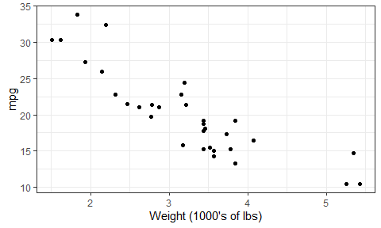<!-- -->

Example: What can we say about rear axle ratio if we know something about quarter mile time?


```r
ggplot(mtcars, aes(qsec, drat)) + 
  geom_point() +
  labs(x = "Quarter mile time",
       y = "Rear axle ratio")
```

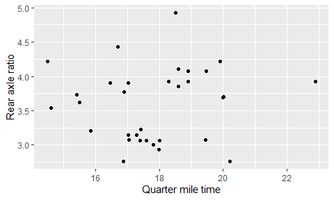<!-- -->


If EDA isn't enough, we can answer these questions by fitting a model: a curve that predicts Y given X. Aka, a __regression curve__ or a __machine learning model__. 

(There are more comprehensive models too, such as modelling entire distributions, but that's not what we're doing here)

There are typically two goals of fitting a model:

1. Make predictions.
2. Interpret variable relationships.

## Fitting a model in R

Model fitting methods tend to use a common format in R:

```
method(formula, data, options)
```

They also tend to have a common output: a special _list_. 

__Method__:

A function such as:

- Linear Regression: `lm`
- Generalized Linear Regression: `glm`
- Local regression: `loess`
- Quantile regression: `quantreg::rq`
- ...

__Formula__:

In R, takes the form `y ~ x1 + x2 + ... + xp` (use column names in your data frame).

__Data__: The data frame.

__Options__: Specific to the method.

Exercise:

1. Fit a linear regression model to life expectancy ("Y") from year ("X") by filling in the formula. Notice what appears as the output.
2. On a new line, use the `unclass` function to uncover the object's true nature: a list. Note: it might be easier to use the `names` function to see what components are included in the list. 

First, create a subset of the `gapminder` dataset containing only the country of `France

```r
(gapminder_France <- gapminder %>%
   filter(country == "France"))
```

<div data-pagedtable="false">
  <script data-pagedtable-source type="application/json">
{"columns":[{"label":["country"],"name":[1],"type":["fctr"],"align":["left"]},{"label":["continent"],"name":[2],"type":["fctr"],"align":["left"]},{"label":["year"],"name":[3],"type":["int"],"align":["right"]},{"label":["lifeExp"],"name":[4],"type":["dbl"],"align":["right"]},{"label":["pop"],"name":[5],"type":["int"],"align":["right"]},{"label":["gdpPercap"],"name":[6],"type":["dbl"],"align":["right"]}],"data":[{"1":"France","2":"Europe","3":"1952","4":"67.410","5":"42459667","6":"7029.809"},{"1":"France","2":"Europe","3":"1957","4":"68.930","5":"44310863","6":"8662.835"},{"1":"France","2":"Europe","3":"1962","4":"70.510","5":"47124000","6":"10560.486"},{"1":"France","2":"Europe","3":"1967","4":"71.550","5":"49569000","6":"12999.918"},{"1":"France","2":"Europe","3":"1972","4":"72.380","5":"51732000","6":"16107.192"},{"1":"France","2":"Europe","3":"1977","4":"73.830","5":"53165019","6":"18292.635"},{"1":"France","2":"Europe","3":"1982","4":"74.890","5":"54433565","6":"20293.897"},{"1":"France","2":"Europe","3":"1987","4":"76.340","5":"55630100","6":"22066.442"},{"1":"France","2":"Europe","3":"1992","4":"77.460","5":"57374179","6":"24703.796"},{"1":"France","2":"Europe","3":"1997","4":"78.640","5":"58623428","6":"25889.785"},{"1":"France","2":"Europe","3":"2002","4":"79.590","5":"59925035","6":"28926.032"},{"1":"France","2":"Europe","3":"2007","4":"80.657","5":"61083916","6":"30470.017"}],"options":{"columns":{"min":{},"max":[10]},"rows":{"min":[10],"max":[10]},"pages":{}}}
  </script>
</div>

Now, using the `lm()` function we will create the linear model

```r
(my_lm <- lm(lifeExp ~ year, gapminder_France))
```

```
## 
## Call:
## lm(formula = lifeExp ~ year, data = gapminder_France)
## 
## Coefficients:
## (Intercept)         year  
##   -397.7646       0.2385
```
Does that mean that the life expectency at "year 0" was equal to -397.7646?!
We are interested in the modeling results around the modeling period which starts at year 1952. To get a meaniningful "interpretable" intercept we can use the `I()` function.

```r
(my_lm <- lm(lifeExp ~ I(year-1952), gapminder_France))
```

```
## 
## Call:
## lm(formula = lifeExp ~ I(year - 1952), data = gapminder_France)
## 
## Coefficients:
##    (Intercept)  I(year - 1952)  
##        67.7901          0.2385
```

Use the `unclass()` function to take a look at how the `lm()` object actually looks like.

```r
unclass(my_lm)
```

```
## $coefficients
##    (Intercept) I(year - 1952) 
##     67.7901282      0.2385014 
## 
## $residuals
##           1           2           3           4           5           6 
## -0.38012821 -0.05263520  0.33485781  0.18235082 -0.18015618  0.07733683 
##           7           8           9          10          11          12 
## -0.05517016  0.20232284  0.12981585  0.11730886 -0.12519814 -0.25070513 
## 
## $effects
##    (Intercept) I(year - 1952)                                              
##  -257.55220231    14.26030956     0.41516662     0.26479522    -0.09557618 
##                                                                            
##     0.16405242     0.03368103     0.29330963     0.22293823     0.21256684 
##                               
##    -0.02780456    -0.15117596 
## 
## $rank
## [1] 2
## 
## $fitted.values
##        1        2        3        4        5        6        7        8 
## 67.79013 68.98264 70.17514 71.36765 72.56016 73.75266 74.94517 76.13768 
##        9       10       11       12 
## 77.33018 78.52269 79.71520 80.90771 
## 
## $assign
## [1] 0 1
## 
## $qr
## $qr
##    (Intercept) I(year - 1952)
## 1   -3.4641016   -95.26279442
## 2    0.2886751    59.79130372
## 3    0.2886751     0.18965544
## 4    0.2886751     0.10603124
## 5    0.2886751     0.02240704
## 6    0.2886751    -0.06121716
## 7    0.2886751    -0.14484136
## 8    0.2886751    -0.22846557
## 9    0.2886751    -0.31208977
## 10   0.2886751    -0.39571397
## 11   0.2886751    -0.47933817
## 12   0.2886751    -0.56296237
## attr(,"assign")
## [1] 0 1
## 
## $qraux
## [1] 1.288675 1.273280
## 
## $pivot
## [1] 1 2
## 
## $tol
## [1] 1e-07
## 
## $rank
## [1] 2
## 
## attr(,"class")
## [1] "qr"
## 
## $df.residual
## [1] 10
## 
## $xlevels
## named list()
## 
## $call
## lm(formula = lifeExp ~ I(year - 1952), data = gapminder_France)
## 
## $terms
## lifeExp ~ I(year - 1952)
## attr(,"variables")
## list(lifeExp, I(year - 1952))
## attr(,"factors")
##                I(year - 1952)
## lifeExp                     0
## I(year - 1952)              1
## attr(,"term.labels")
## [1] "I(year - 1952)"
## attr(,"order")
## [1] 1
## attr(,"intercept")
## [1] 1
## attr(,"response")
## [1] 1
## attr(,".Environment")
## <environment: R_GlobalEnv>
## attr(,"predvars")
## list(lifeExp, I(year - 1952))
## attr(,"dataClasses")
##        lifeExp I(year - 1952) 
##      "numeric"      "numeric" 
## 
## $model
##    lifeExp I(year - 1952)
## 1   67.410              0
## 2   68.930              5
## 3   70.510             10
## 4   71.550             15
## 5   72.380             20
## 6   73.830             25
## 7   74.890             30
## 8   76.340             35
## 9   77.460             40
## 10  78.640             45
## 11  79.590             50
## 12  80.657             55
```

To complicate things further, some info is stored in _another_ list after applying the `summary` function:


```r
summary(my_lm)
```

```
## 
## Call:
## lm(formula = lifeExp ~ I(year - 1952), data = gapminder_France)
## 
## Residuals:
##      Min       1Q   Median       3Q      Max 
## -0.38013 -0.13894  0.01235  0.14295  0.33486 
## 
## Coefficients:
##                Estimate Std. Error t value Pr(>|t|)    
## (Intercept)    67.79013    0.11949  567.33  < 2e-16 ***
## I(year - 1952)  0.23850    0.00368   64.81 1.86e-14 ***
## ---
## Signif. codes:  0 '***' 0.001 '**' 0.01 '*' 0.05 '.' 0.1 ' ' 1
## 
## Residual standard error: 0.22 on 10 degrees of freedom
## Multiple R-squared:  0.9976,	Adjusted R-squared:  0.9974 
## F-statistic:  4200 on 1 and 10 DF,  p-value: 1.863e-14
```

Let's see and plot the residuals for my_lm. 


```r
my_lm_resid <- augment(my_lm)
my_lm_resid
```

<div data-pagedtable="false">
  <script data-pagedtable-source type="application/json">
{"columns":[{"label":["lifeExp"],"name":[1],"type":["dbl"],"align":["right"]},{"label":["I.year...1952."],"name":[2],"type":["S3: AsIs"],"align":["right"]},{"label":[".fitted"],"name":[3],"type":["dbl"],"align":["right"]},{"label":[".se.fit"],"name":[4],"type":["dbl"],"align":["right"]},{"label":[".resid"],"name":[5],"type":["dbl"],"align":["right"]},{"label":[".hat"],"name":[6],"type":["dbl"],"align":["right"]},{"label":[".sigma"],"name":[7],"type":["dbl"],"align":["right"]},{"label":[".cooksd"],"name":[8],"type":["dbl"],"align":["right"]},{"label":[".std.resid"],"name":[9],"type":["dbl"],"align":["right"]}],"data":[{"1":"67.410","2":"0","3":"67.79013","4":"0.11949006","5":"-0.38012821","6":"0.29487179","7":"0.1761573","8":"0.884905601","9":"-2.0572208"},{"1":"68.930","2":"5","3":"68.98264","4":"0.10436387","5":"-0.05263520","6":"0.22494172","7":"0.2310920","8":"0.010712566","9":"-0.2717027"},{"1":"70.510","2":"10","3":"70.17514","4":"0.09045978","5":"0.33485781","6":"0.16899767","7":"0.1969978","8":"0.283358854","9":"1.6693375"},{"1":"71.550","2":"15","3":"71.36765","4":"0.07843046","5":"0.18235082","6":"0.12703963","7":"0.2226395","8":"0.057240744","9":"0.8869421"},{"1":"72.380","2":"20","3":"72.56016","4":"0.06925976","5":"-0.18015618","6":"0.09906760","7":"0.2231544","8":"0.040905832","9":"-0.8625572"},{"1":"73.830","2":"25","3":"73.75266","4":"0.06418491","5":"0.07733683","6":"0.08508159","7":"0.2303787","8":"0.006277450","9":"0.3674346"},{"1":"74.890","2":"30","3":"74.94517","4":"0.06418491","5":"-0.05517016","6":"0.08508159","7":"0.2311516","8":"0.003194619","9":"-0.2621187"},{"1":"76.340","2":"35","3":"76.13768","4":"0.06925976","5":"0.20232284","6":"0.09906760","7":"0.2207992","8":"0.051591334","9":"0.9686874"},{"1":"77.460","2":"40","3":"77.33018","4":"0.07843046","5":"0.12981585","6":"0.12703963","7":"0.2272790","8":"0.029009837","9":"0.6314156"},{"1":"78.640","2":"45","3":"78.52269","4":"0.09045978","5":"0.11730886","6":"0.16899767","7":"0.2279489","8":"0.034775833","9":"0.5848096"},{"1":"79.590","2":"50","3":"79.71520","4":"0.10436387","5":"-0.12519814","6":"0.22494172","7":"0.2270542","8":"0.060608945","9":"-0.6462723"},{"1":"80.657","2":"55","3":"80.90771","4":"0.11949006","5":"-0.25070513","6":"0.29487179","7":"0.2095151","8":"0.384913541","9":"-1.3567943"}],"options":{"columns":{"min":{},"max":[10]},"rows":{"min":[10],"max":[10]},"pages":{}}}
  </script>
</div>

```r
ggplot(my_lm_resid, aes(.resid)) +
  geom_freqpoly(binwidth = 0.5) + 
  theme_bw()
```

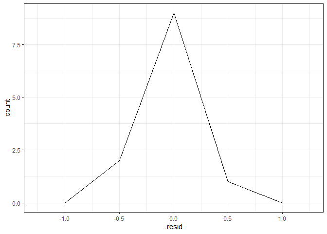<!-- -->


We can use the `predict()` function to make predictions from the model (default is to use fitting/training data). Here are the predictions:


```r
gapminder_France2 <- data.frame(year = seq(2000, 2005))
predict(my_lm, newdata = gapminder_France2) %>% 
  head()
```

```
##       1       2       3       4       5       6 
## 79.2382 79.4767 79.7152 79.9537 80.1922 80.4307
```

```r
plot(my_lm)
```

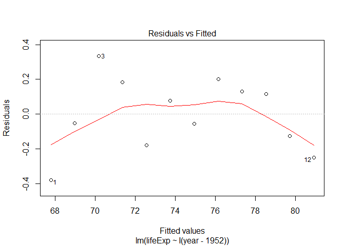<!-- -->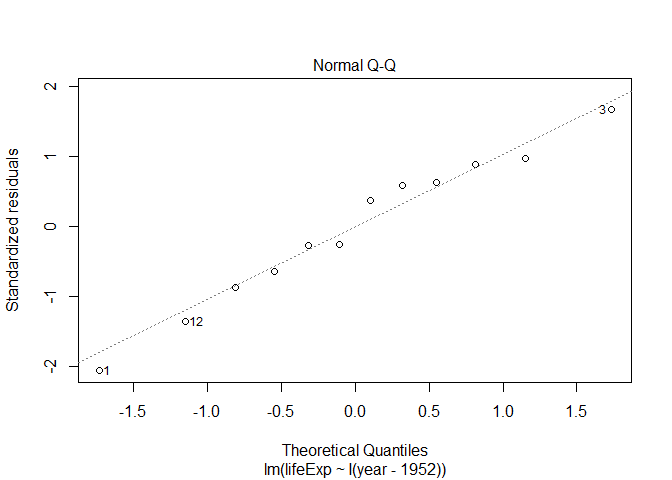<!-- -->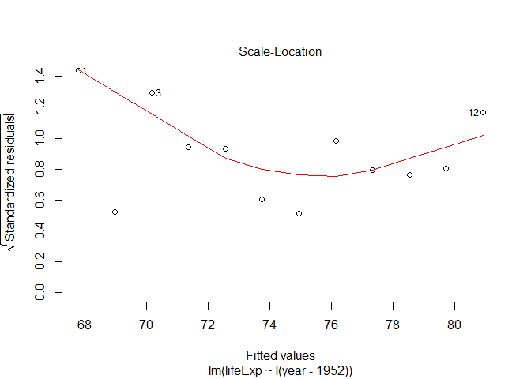<!-- -->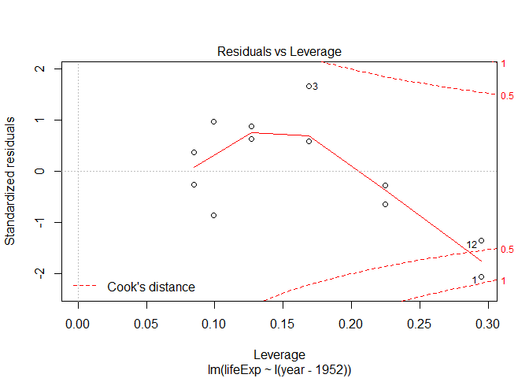<!-- -->

Note that because of the y-axis shift, the years start at 1 instead of 1952

Or we can predict on a new dataset: __[SKIPPED]__

```r
years1 = FILL_THIS_IN
```

```
## Error in eval(expr, envir, enclos): object 'FILL_THIS_IN' not found
```

```r
predict(my_lm,years1)
```

```
## Error in predict.lm(my_lm, years1): object 'years1' not found
```


We can plot models (with one predictor/ X variable) using `ggplot2` through the `geom_smooth()` layer. Specifying `method="lm"` gives us the linear regression fit (but only visually!):


```r
ggplot(gapminder, aes(gdpPercap, lifeExp)) +
    geom_point() +
    geom_smooth(method="lm") +
    scale_x_log10() +
    theme_bw()
```

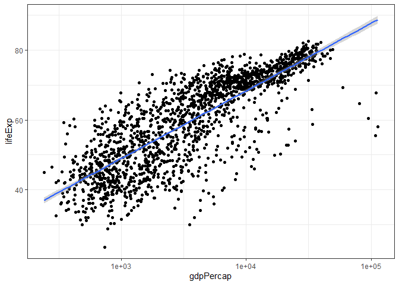<!-- -->
Lets consider another country "Zimbabwe", which has a unique behavior in the `lifeExp` and `year` relationship.

```r
gapminder_Zimbabwe <- gapminder %>%
  filter(country == "Zimbabwe")
gapminder_Zimbabwe %>% 
  ggplot(aes(year, lifeExp)) + 
  geom_point() + 
  theme_bw()
```

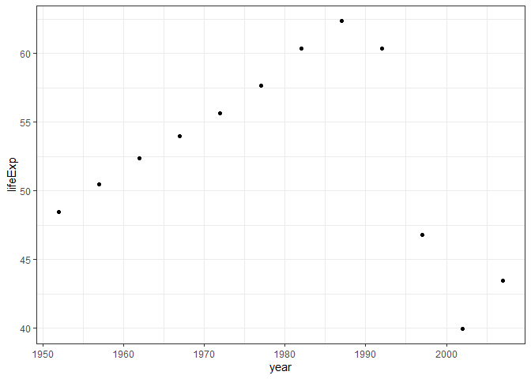<!-- -->
Let's try fitting a linear model to this relationship

```r
ggplot(gapminder_Zimbabwe, aes(year,lifeExp)) + 
  geom_point() +
  geom_smooth(method = "lm", se = F) +
  theme_bw()
```

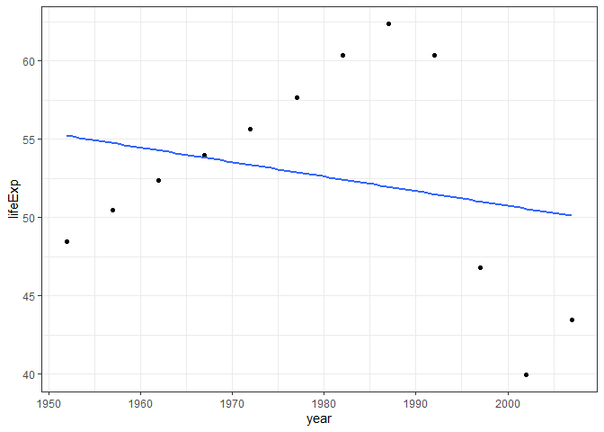<!-- -->

This linear model is not accurate for our data! (based on the data distribution)

Now we will try to fit a second degree polynomial and see what would that look like.

```r
ggplot(gapminder_Zimbabwe, aes(year, lifeExp)) + 
  geom_point() +
  geom_smooth(method = "lm", 
              formula = y ~ poly(I(x-1952), degree = 2)) +
  theme_bw()
```

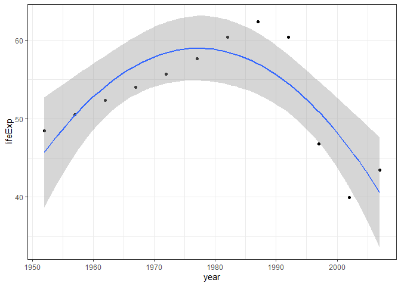<!-- -->


```r
lm_linear <- lm(data = gapminder,formula = FILL_THIS_IN)
lm_poly <- lm(data = gapminder,formula = FILL_THIS_IN))
```

```
## Error: <text>:2:55: unexpected ')'
## 1: lm_linear <- lm(data = gapminder,formula = FILL_THIS_IN)
## 2: lm_poly <- lm(data = gapminder,formula = FILL_THIS_IN))
##                                                          ^
```
`anova` lets you compare between different models.

```r
anova(lm_linear,lm_poly)
```

```
## Error in anova(lm_linear, lm_poly): object 'lm_linear' not found
```
## Regression with categorical variables


```r
(lm_cat <- lm(gdpPercap ~ I(year - 1952) + continent, data = gapminder))
```

```
## 
## Call:
## lm(formula = gdpPercap ~ I(year - 1952) + continent, data = gapminder)
## 
## Coefficients:
##       (Intercept)     I(year - 1952)  continentAmericas  
##           -1375.3              129.8             4942.4  
##     continentAsia    continentEurope   continentOceania  
##            5708.4            12275.7            16427.9
```
How did R know that continent was a categorical variable?

```r
class(gapminder$continent)
```

```
## [1] "factor"
```

```r
levels(gapminder$continent)
```

```
## [1] "Africa"   "Americas" "Asia"     "Europe"   "Oceania"
```

```r
contrasts(gapminder$continent)
```

```
##          Americas Asia Europe Oceania
## Africa          0    0      0       0
## Americas        1    0      0       0
## Asia            0    1      0       0
## Europe          0    0      1       0
## Oceania         0    0      0       1
```
How can we change the reference level?

```r
gapminder$continent <- relevel(gapminder$continent, ref = "Oceania")
```
Let's build a new model

```r
lm_cat2 <- lm(gdpPercap ~ I(year - 1952) + continent, data = gapminder)
```


## Broom

Let's make it easier to extract info, using the `broom` package. There are three crown functions in this package, all of which input a fitted model, and outputs a tidy data frame.

1. `tidy`: extract statistical summaries about each component of the model.
    - Useful for _interpretation_ task.
2. `augment`: add columns to the original data frame, giving information corresponding to each row.
    - Useful for _prediction_ task.
3. `glance`: extract statistical summaries about the model as a whole (1-row tibble).
    - Useful for checking goodness of fit.

Exercise: apply all three functions to our fitted model, `my_lm`. What do you see?


